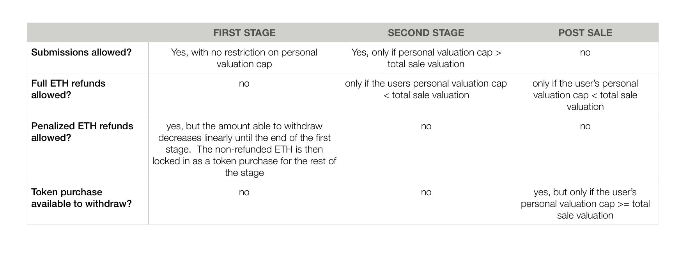
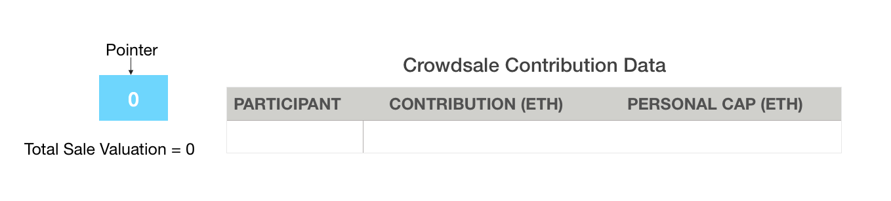
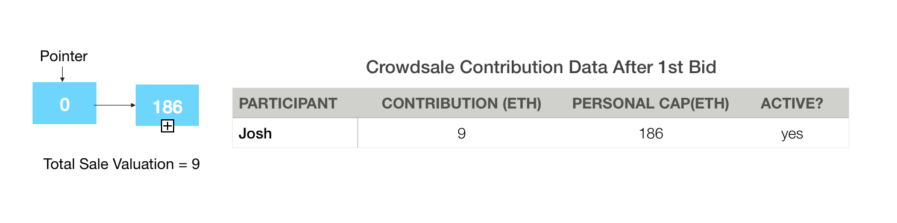
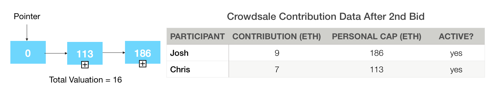
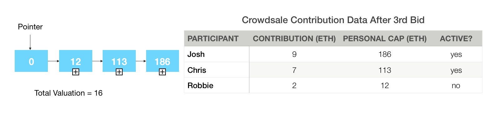
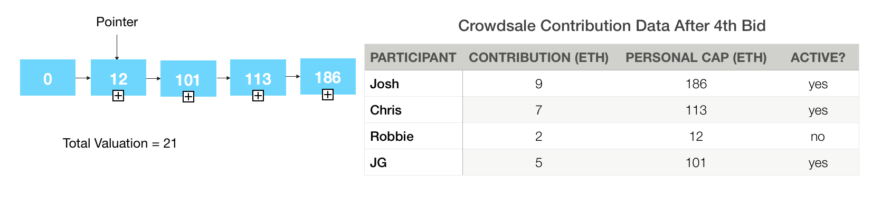
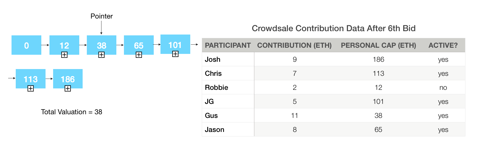
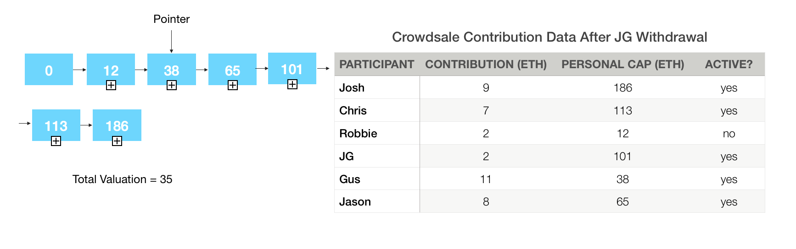

InteractiveCrowdsaleLib
=========================   

A crowdsale library to use for interactive crowdsale contract deployment.

<!-- START doctoc generated TOC please keep comment here to allow auto update -->
<!-- DON'T EDIT THIS SECTION, INSTEAD RE-RUN doctoc TO UPDATE -->


- [Library Address](#library-address)
- [How to install](#how-to-install)
  - [Truffle Installation](#truffle-installation)
- [Development](#development)
- [Setting Up](#setting-up)
- [Running Tests](#running-tests)
- [Code Contributions](#code-contributions)
- [License and Warranty](#license-and-warranty)
  - [Basic Usage](#basic-usage)
- [Implementation Details](#implementation-details)
  - [Valuation Cutoff Pointer](#valuation-cutoff%C2%A0pointer)
  - [Bid Process](#bid-process)
  - [Valuation Pointer Mechanics Walkthrough](#valuation-pointer-mechanics-walkthrough)
  - [Withdrawals During the First Stage of the Sale](#withdrawals-during-the-first-stage-of-the%C2%A0sale)
- [Functions](#functions)
    - [init](#initinteractivecrowdsalelibinteractivecrowdsalestorage-storage-address-uint256-uint256-uint256uint256-uint256-uint8-string-string-uint8-bool)
      - [Arguments](#arguments)
      - [Returns](#returns)
    - [numDigits](#numdigitsinteractivecrowdsalelibinteractivecrowdsalestorage-storage-uint256)
      - [Arguments](#arguments-1)
      - [Returns](#returns-1)
    - [calculateTokenPurchase](#calculatetokenpurchaseinteractivecrowdsalelibinteractivecrowdsalestorage-storage-uint256-uint256)
      - [Arguments](#arguments-2)
      - [Returns](#returns-2)
    - [getCurrentBonus](#getcurrentbonusinteractivecrowdsalelibinteractivecrowdsalestorage-storage)
      - [Arguments](#arguments-3)
      - [Returns](#returns-3)
    - [submitBid](#submitbidinteractivecrowdsalelibinteractivecrowdsalestorage-storage-uint256-uint256-uint256)
      - [Arguments](#arguments-4)
      - [Returns](#returns-4)
    - [withdrawBid](#withdrawbidinteractivecrowdsalelibinteractivecrowdsalestorage-storage)
      - [Arguments](#arguments-5)
      - [Returns](#returns-5)
    - [finalizeSale](#finalizesaleinteractivecrowdsalelibinteractivecrowdsalestorage-storage)
      - [Arguments](#arguments-6)
      - [Returns](#returns-6)
    - [launchToken](#launchtokeninteractivecrowdsalelibinteractivecrowdsalestorage-storage)
      - [Arguments](#arguments-7)
      - [Returns](#returns-7)
    - [setCanceled](#setcanceledinteractivecrowdsalelibinteractivecrowdsalestorage-storage)
      - [Arguments](#arguments-8)
      - [Returns](#returns-8)
    - [retreiveFinalResult](#retreivefinalresultinteractivecrowdsalelibinteractivecrowdsalestorage-storage)
      - [Arguments](#arguments-9)
      - [Returns](#returns-9)

<!-- END doctoc generated TOC please keep comment here to allow auto update -->

## Library Address   

**ENS**: TBD   
**Main Ethereum Network**: 0xbb03C8c529CcE73Ee350A4eBB2A6F712A8E9e348    
**Ropsten Test Network**: Not available at this time.    
**Rinkeby Test Network**: 0xb70364d1C6eCFa89526e7B40dFA2270BBEfFA853    

## How to install

### Truffle Installation

**version 4.0.1**   

First install truffle via npm using `npm install -g truffle` .   

Please [visit Truffle's installation guide](http://truffleframework.com/docs/getting_started/installation "Truffle installation guide") for further information and requirements.

## Development

**Dependencies**

* `node@8.5.x`
* `truffle@^4.0.1`
* `ethereumjs-testrpc@^6.0.x`

## Setting Up

* Clone this repository.

* Install all [system dependencies](#development).

  * `cd truffle && npm install`

* Compile contract code

  * `node_modules/.bin/truffle compile`

## Running Tests

* `bash run_test.sh`

## Code Contributions

If you see an issue please don't hesitate to dive in. We welcome help in any form and are more than willing to offer our assistance to developers who want to contribute to documentation, code fixes, or even new libraries or functionality! We ask that you follow a few guidelines when making changes to the repo:

1. Create an issue for changes being made.
2. Create a branch named for the issue ie 7-[label].
3. Use keyword `Closes #[issue-number]` when opening a PR.


**DISCLAIMER:** As always, please ensure you review this code thoroughly for your team's use. We strive to make our code as solid, clean, and well documented as possible but will not accept liability for unforeseen circumstances in which value is lost or stolen. This includes but not limited to any inability to meet signature requirements to move funds, loss of private keys, transactions you deem unauthorized from an owner's account, etc. The library code has been thoroughly tested by our team and believe it to be suitable enough to be posted in our open source repository, however, you are still responsible for its implementation and security in your smart contract. Please use your best judgment. Please let us know immediately if you have discovered any issues or vulnerabilities with this library.


## License and Warranty

Be advised that while we strive to provide professional grade, tested code we cannot guarantee its fitness for your application. This is released under [The MIT License (MIT)](https://github.com/Modular-Network/ethereum-libraries/blob/master/LICENSE "MIT License") and as such we will not be held liable for lost funds, etc. Please use your best judgment and note the following:

THE SOFTWARE IS PROVIDED "AS IS", WITHOUT WARRANTY OF ANY KIND, EXPRESS OR IMPLIED, INCLUDING BUT NOT LIMITED TO THE WARRANTIES OF MERCHANTABILITY, FITNESS FOR A PARTICULAR PURPOSE AND NON-INFRINGEMENT. IN NO EVENT SHALL THE AUTHORS OR COPYRIGHT HOLDERS BE LIABLE FOR ANY CLAIM, DAMAGES OR OTHER LIABILITY, WHETHER IN AN ACTION OF CONTRACT, TORT OR OTHERWISE, ARISING FROM, OUT OF OR IN CONNECTION WITH THE SOFTWARE OR THE USE OR OTHER DEALINGS IN THE SOFTWARE.

### Basic Usage

The interactive crowdsale protocol allows participants to submit an ETH payment for tokens along with a personal valuation cap.

ETH Contribution: The Ether that the participant sends to the sale with the expectation of receiving tokens in return. These ETH payments are summed throughout the sale to equal the total sale valuation. 

Total Sale Valuation: The sum of all the active bids in the sale or total amount of ETH raised, not to be confused with the total valuation of the token or project itself, as the sale will only handle a percentage of the total tokens minted. This will fluctuate throughout the sale until the end, when it will reach an equilibrium determined by the participants. 

Personal valuation cap: An indication by each participant that they are willing to leave their token purchase in the sale as long as the maximum total sale valuation does not exceed their personal valuation cap. If, at the very end of the sale, the total sale valuation is greater than their personal valuation cap, the participant’s bid is refunded. 

There are two stages to the sale. In the first stage, participants are allowed to submit and withdraw bids at will. Early bidders receive bonus tokens as part of their purchase. This bonus decreases linearly until the end of the first stage. Participants can manually withdraw their submitted bid and receive a linearly decreasing percentage of their ETH back. The ETH that is withheld from this refund still goes towards purchasing tokens for this participant, but forfeits a percentage of the early contribution bonus on these remaining, perminently committed tokens. See section 5.3 of the technical paper for an explanation of why these two penalties are necessary. The ETH that was withheld still goes towards the crowdsale in the form of a token purchase — this penalized ETH is no longer able to be withdrawn. In this stage, the total sale valuation will fluctuate as bids are submitted and withdrawn.
Since the total sale valuation can move up and down in the first stage due to deposits and withdrawals, every bid is still ‘active’ even if a personal valuation cap is exceeded.
The transition between the first and second stage is termed the “withdrawal lock.” In the second stage, submissions are still allowed, but all active bids are committed for the duration of the sale. Withdrawing ETH refunds are only allowed if the participant has a minimal bid, meaning their personal cap is less than the total sale valuation — in other words, excluded from the sale. These withdrawals receive complete refunds because their contributions have no effect on the sale. After the withdrawal lock, the total sale valuation will monotonically increase, meaning it can only stay the same or increase.




## Implementation Details

See [Modular's Crowdsale Repo](https://github.com/Modular-Network/ethereum-libraries/tree/master/CrowdsaleLib) to see how these libraries are structured. Essentially, Every crowdsale library uses the CrowdsaleLib.sol and CrowdsaleLib.json files as a base contract. Then another library, in this case InteractiveCrowdsaleLib.sol, inherits the base and is inherited by a Test contract so the contract can use it's data structure and functions.

Base Crowdsale Logic: CrowdsaleLib.sol
Interactive ICO-Specific Logic: InteractiveCrowdsaleLib.sol
Contract that implements Library functions: InteractiveCrowdsaleTestContract.sol

From now on, we will use the same terms to describe aspects of the implementation that are in the code, described below:

bid: describes the ETH and personal valuation that a participant sends to a contract to indicate participation in the sale
withdrawal lock: The point in time when individual withdrawals who's personal valuation caps are above the sale valuation are no longer allowed.

```
    // List of personal valuations, sorted from smallest to largest (from LinkedListLib)
    LinkedListLib.LinkedList valuationsList;

    // Info holder for token creation
    TokenLib.TokenStorage tokenInfo;

    uint256 endWithdrawalTime;   // time when manual withdrawals are no longer allowed

    // current total valuation of the sale
    // actual amount of ETH committed, taking into account partial purchases
    uint256 totalValuation;

    // amount of value committed at this valuation, cannot rely on owner balance
    // due to fluctations in commitment calculations needed after owner withdraws
    // the amount of ETH committed, including total bids that will eventually get partial purchases
    uint256 valueCommitted;

    // the bucket that sits either at or just below current total valuation
    uint256 currentBucket;

    // minimim amount that the sale needs to make to be successfull
    uint256 minimumRaise;

    // percentage of total tokens being sold in this sale
    uint8 percentBeingSold;

    // the bonus amount for early bidders
    uint256 priceBonusPercent;

    bool ownerHasWithdrawnETH;

    // shows the price that the address purchased tokens at
    mapping (address => uint256) pricePurchasedAt;

    // the sums of bids at each valuation
    mapping (uint256 => uint256) valuationSums;

    // the number of active bids at a certain valuation cap
    mapping (uint256 => uint256) numBidsAtValuation;

    // the valuation cap that each address has submitted
    mapping (address => uint256) personalCaps;

    // shows if an address has done a manual withdrawal
    mapping (address => bool) hasManuallyWithdrawn;
```

The redesign constantly calculates the cutoff for participation in the sale and keeps a record of which bids are valid and which aren’t, without automatic refunds. After the sale ends, participants can withdraw their tokens if their cap was not exceeded by the total value. If their valuation cap was exceeded, they were essentially removed from the sale, so their total amount of ETH they contributed to the sale is refunded and available for withdrawal. This avoids costly looping and calculations that were needed in the previous version when bids were sorted and removed/partially removed throughout the sale, cutting down on gas price. Sending ETH is a costly transaction, so removing all the unnecessary ETH transfers is very important. Both versions enforce the monotonically increasing valuation variant discussed in section 5.2 of the technical paper, but this version significantly cuts down on gas costs.

This version also enforces that personal valuation caps can only be submitted in evenly spaced valuations. These are spaced by the 3 most significant digits of each personal valuation cap. These make it so there is even spacing in the linked list struct that holds the personal valuations, meaning the bids are spaced in a more efficient fashion, further saving gas on searching the linked list.

### Valuation Cutoff Pointer

To accomplish this, the library utilizes a pointer throughout the sale that indicates which personal valuation cap in the linked list is the cutoff point for being allowed in the sale. It only counts bids towards the total sale valuation that have personal valuation caps that are greater than the total sale valuation. This pointer will be correlated to the total sale valuation, but since it will always point to a submitted personal valuation cap, it will often not be exactly equal to the total sale valuation, but will be relatively close.

At the beginning of the sale, the pointer is set at 0, indicating that the valuation of the sale is 0 and there are no bids that have been submitted or “discarded” from the sale.



### Bid Process
*This process is taken from the submitBid function in InteractiveCrowdsaleLib.sol*

Every time a new bid is submitted, its personal  valuation cap is added to the sorted linked list of personal  valuation caps. Then the contract adds its bid to a sum of all bids submitted with that same personal  valuation cap. After that, it records the amount of ETH submitted in that bid and the token price bonus at the time the bid was submitted.

Then, if the personal  valuation cap is less than the current total sale valuation, the bid is still registered by the sale, but it is not counted towards the total sale valuation. If the personal  valuation cap is greater than the current total sale valuation, then the bid is added to the current valuation and the cutoff pointer is potentially increased to show which bids have been “kicked out” of the sale. Bids that are overtaken by the pointer are subtracted from the total sale valuation but still remain recorded in case the pointer decreases. 

This valuation cutoff pointer mechanism is active throughout the entire sale, but will increase and decrease during the first stage of the sale. After the withdrawal lock, the pointer, like the total sale valuation, is monotonically increasing, meaning that it cannot decrease, only increase or stay the same, since manual withdrawals are not possible in that stage.

If you reference the technical paper, you’ll see in Section 4, step 3, part 3 that bids that are equal to the current valuation pointer are refunded a portion of their bids instead of being kicked out to keep the valuation monotonically increasing as bids are removed. This is now only necessary to do once, at the very end of the sale. Bids with personal valuation caps equal to the valuation pointer will be partially refunded ETH and receive the rest of their purchase in tokens. This still satisfies the requirement in section 5.2 of the technical paper.

### Valuation Pointer Mechanics Walkthrough

Here is a quick walkthrough with some diagrams to show the correct pointer movement. We’ll start with the first bid in the sale, Josh sending 9 ETH with a personal valuation cap of 186 ETH. Here is the state after the first bid.



As you can see, Josh has contributed 9 ETH, so the total sale valuation has increased to 9. His personal  valuation cap was added to the sorted list of caps, but since the total sale valuation is still less than his cap, the pointer is still pointing at zero, showing that all bids still remain in the sale. 

You might be confused that the pointer isn’t equal to the current valuation. The reason for this is that the pointer needs to always point at one of the personal valuation caps, indicating which cap is the cutoff to remain in the sale. This is slightly different than what is specified in section 4 of the technical paper, but necessary for proper functionality of the pointer mechanism and ensuring monotonically increasing sale valuation.

A similar state happens when the second bid is submitted with a high personal valuation cap:




Going smoothly so far! Now lets see what happens when a bid is submitted with a personal valuation cap that is less than the total sale valuation:





The bid has a personal valuation cap below the total sale valuation, so it doesn’t affect the sale at allPointer is fixed when another bid comes inAs you can see, Robbie’s bid with a personal valuation cap less than the total sale valuation is still recorded in the list and storage, but does not affect the total sale valuation or pointer at all. When another bid comes in, the pointer is moved to 12 to show that personal  valuation caps of 12 and lower are not involved in the sale.

Now lets see what happens when a bidders cap is exceeded:



As you can see from the next two bids, the total sale valuation would increase to more than Gus’ cap of 38, but removing his bid would decrease the total sale valuation to below 38. This creates an issue with deciding whether or not he should remain in the sale. The sale accounts for this by moving the pointer to 38, his cap, and setting the total sale valuation to the same number. This indicates that he will get a partial purchase of his tokens when he withdraws his tokens at the end of the sale.

### Withdrawals During the First Stage of the Sale

At some point, some of the participants might want to manually withdraw their bid. To protect from blackout attacks (detailed in section 5.3 of the technical paper)  contributors that manually withdraw will forfeit part of their early contribution bonus and a portion of their contribution will be locked in to the sale. When a contributor withdraws, they will get a partial refund, the rest will be converted to tokens, minus part of the early contribution bonus. You can read about the reasoning for this choice in section 5.3 of the technical paper. Please remember, this is only for manual withdrawals before the “withdrawal lock”. Automated withdrawals due to personal cap being lower than the total valuation will not be penalized.

Let’s look at how it would affect our example sale.

In this example, JG wants to withdraw his 5 ETH contribution from the sale. The figure shows the state of the sale after the withdrawal.



The penalty increases linearly throughout the first stage of the sale. For simplicity’s sake, we are assuming that the penalty at this point is 40%. JG gets 3 ETH back and the remaining 2 is still committed to the sale. This decreases the total sale valuation to 35, and the pointer stays at 38. If there was a bid with a personal valuation cap of 35, the pointer would be pointing at that, but since there isn’t, it stays at 38.

As you can probably imagine, manual withdrawals can lead to a reduction in the Total Valuation and as a result, bids that were previously excluded can once again be included.

For clarification, bids that have been passed by the valuation pointer are still subject to the withdrawal penalty before the withdrawal lock, but not after. You can read the reasoning for this in section 5.3 of the technical paper.

Most of the algorithms for tracking bids require changing only a few values and iterating over a small number of nodes in the linked list. This significantly decreases the potential gas cost compared to the costly operations required for looping through the list, removing nodes, giving bidders with minimal bids partial refunds after each loop, and resetting bidders stored bid history.

**Addresses can only submit one bid each.**

The bidders submit a prediction for where to start searching in the list. We chose this with the intent that the owner will publish the valuations at certain placements in the linked list, like 1/4 of the way through, 1/2 way through, 3/4 of the way through, etc depending on the size of the list. Bidders chose the search prediction that is closest to their personal Valuation to save time and gas in finding their spot in the list.


## Functions

The following is the list of functions available to use in your smart contract.

### init(InteractiveCrowdsaleLib.InteractiveCrowdsaleStorage storage, address, uint256[], uint256, uint256,uint256 uint256, uint8, string, string, uint8, bool)   
*(InteractiveCrowdsaleLib.sol, line 144)*

Constructor. Initialize the crowdsale with owner, sale data, bonus percentage, minimum raise, Time of thw withdrawal lock, endTime, percent of tokens being sold, token Name, token Symbol, token number of Decimals, and an indication to allow minting of tokens or not.  Passes some values to the base constructor then sets the interactive crowdsale specific storage variables.

#### Arguments
**InteractiveCrowdsaleLib.InteractiveCrowdsaleStorage** `self`   
**address[]** `_owner` Address of crowdsale owner   
**uint256[]** `_saleData` intital sale data(startTime,initialtokensPerEth)  
**uint256** `_priceBonusPercent` percentage of the token price that participants receive as an additional token purchase at the beginning of the sale.   
**uint256** `_minimumRaise` the minimim ETH raise the sale can have to be successful.   
**uint256** `_endWithdrawalTime` The time when manual withdrawals are prohibited.    
**uint256** `_endTime` the end of the sale  
**uint8** `_percentBeingSold` percentage of the total amount of tokens being offered in this sale,     
**string** `_tokenName` the name of the token for the ERC20 contract    
**string** `_tokenSymbol` The symbol for the token for the ERC20 contract  
**uint8** `_tokenDecimals` number of decimals for the token  
**bool** `_allowMinting` indicates if minting of the token should be allowed after the sale.

#### Returns
No return   

### numDigits(InteractiveCrowdsaleLib.InteractiveCrowdsaleStorage storage, uint256)   
*(InteractiveCrowdsaleLib.sol, line 184)*

Gets the number of digits in `_number`. Used to enforce spaced buckets for personal valuation caps.

#### Arguments
**InteractiveCrowdsaleLib.InteractiveCrowdsaleStorage** `self`  
**uint256** `_number` the number to find the number of digits for.  

#### Returns
**uint256**   

### calculateTokenPurchase(InteractiveCrowdsaleLib.InteractiveCrowdsaleStorage storage, uint256, uint256)   
*(InteractiveCrowdsaleLib.sol, line 199)*

Calculates the number of tokens purchased based on the amount of wei spent and the price of tokens.

#### Arguments
**InteractiveCrowdsaleLib.InteractiveCrowdsaleStorage** `self`  
**uint256** `_amount` amount of wei sent in the purchase
**uint256** `_price` the price of the tokens being purchased  

#### Returns
**uint256** `numTokens`  number of tokens purchased
**uint256** `remainder`  wei leftover from the purchase  

### getCurrentBonus(InteractiveCrowdsaleLib.InteractiveCrowdsaleStorage storage)   
*(InteractiveCrowdsaleLib.sol, line 225)*

Called when an address wants to submit bid to the sale. This caluculates the bonus percentage the address receives when submitting bids.  The bonus gradually decreases from self.priceBonusPercent to zero from the beginning to the end of the first stage. After the withdrawal lock, there is no bonus.

#### Arguments
**InteractiveCrowdsaleLib.InteractiveCrowdsaleStorage** `self`  

#### Returns
**bool**   

### submitBid(InteractiveCrowdsaleLib.InteractiveCrowdsaleStorage storage, uint256, uint256, uint256)   
*(InteractiveCrowdsaleLib.sol, line 246)*

Allows participants to submit ETH bids with a personal cap and linked list spot prediction.  First, the function checks to see if the bid is valid.  Then it inserts the personal valuation cap into the linked list, if necessary.  It then updates the participants bid records. Lastly, it performs the operations to assign the new valuation pointer to the correct bucket.  It then logs the current token price and emits an event.

#### Arguments
**InteractiveCrowdsaleLib.InteractiveCrowdsaleStorage** `self`   
**uint256** `_amount` the amount of ETH the bidder sent
**uint256** `_personalCap` the user's personal valuation cap
**uint256** `_valuePredict` prediction of where the cap will go in the linked list

#### Returns
**bool**   

### withdrawBid(InteractiveCrowdsaleLib.InteractiveCrowdsaleStorage storage)   
*(InteractiveCrowdsaleLib.sol, line 360)*

Withdraws the participant's bid from the sale. If it is after the withdrawal lock and the participant has a minimal personal cap, they get a full refund.  If it is before the withdrawal lock, they receive a partial refund of the ETH.  The withheld ETH still goes towards their token purchase, but is committed to the end of the sale.  Then, if it is before the withdrawal lock, the valuation pointer is updated to reflect the new sale valuation.

#### Arguments
**InteractiveCrowdsaleLib.InteractiveCrowdsaleStorage** `self`  

#### Returns
**bool**   

### finalizeSale(InteractiveCrowdsaleLib.InteractiveCrowdsaleStorage storage)   
*(InteractiveCrowdsaleLib.sol, line 473)*

This should be called once the sale is over to launch the token and record the total ETH raised into the owners withdrawal bucket.

#### Arguments
**InteractiveCrowdsaleLib.InteractiveCrowdsaleStorage** `self`  

#### Returns
**bool**   

### launchToken(InteractiveCrowdsaleLib.InteractiveCrowdsaleStorage storage)   
*(InteractiveCrowdsaleLib.sol, line 501)*

Mints the token being sold by taking the percentage of the token supply being sold in this sale along with the valuation, derives all necessary values, launches the token contract, and then transfers owner tokens to the owner.  If the sale did not reach the minimum valuation, all the tokens are transferred to the owner and all participant's ETH is available for refund.

#### Arguments
**InteractiveCrowdsaleLib.InteractiveCrowdsaleStorage** `self`  

#### Returns
**bool**   

### setCanceled(InteractiveCrowdsaleLib.InteractiveCrowdsaleStorage storage)   
*(InteractiveCrowdsaleLib.sol, line 541)*

Returns a boolean indicating if the sale is canceled. This can either be if the minimum raise hasn't been met or if it is 30 days after the sale and the owner hasn't finalized the sale.

#### Arguments
**InteractiveCrowdsaleLib.InteractiveCrowdsaleStorage** `self`  

#### Returns
**bool**   

### retreiveFinalResult(InteractiveCrowdsaleLib.InteractiveCrowdsaleStorage storage)   
*(InteractiveCrowdsaleLib.sol, line 554)*

Called by participants after the sale ends.  Finalizes a participant's participation in the sale.  If the address' personal cap is below the pointer or the sale is cancelled, refund them all their ETH. If their personal valuation cap is equal to the total valuation, they get a partial ETH refund and a partial token purchase.  If their personal valuation cap is greater than the total valuation, the function calculates tokens purchased and sends them their tokens.  This is the last function participants have to call.

#### Arguments
**InteractiveCrowdsaleLib.InteractiveCrowdsaleStorage** `self`  

#### Returns
**bool**   
